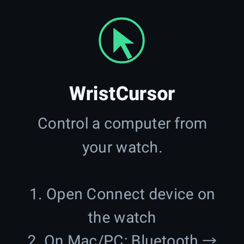
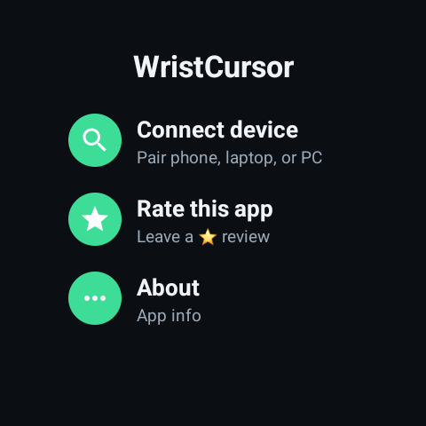
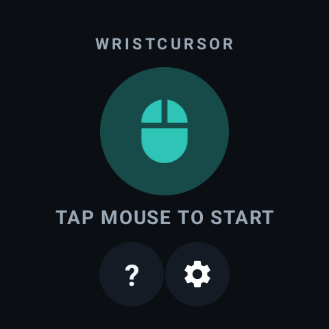
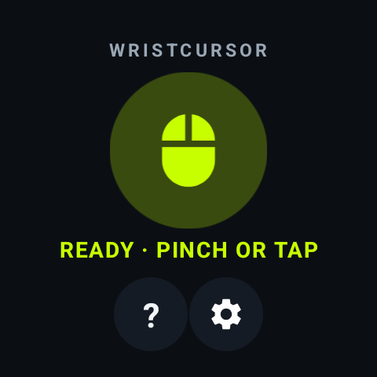

# WristCursor

**Turn your Galaxy Watch into a wireless mouse for any device.**

Move your wrist to steer the pointer. Pinch your thumb and finger to click. Your
watch pairs as an ordinary Bluetooth mouse, so the phone, tablet, PC or TV you
are controlling needs nothing installed — no companion app, no drivers, no
account.

Created and maintained by **Varad Dhananjay Dorle**.

## The app

| | | | |
|:-:|:-:|:-:|:-:|
|  |  |  |  |
| Welcome | Home | Paused | Ready |

Captured on a Galaxy Watch 6 (44 mm, 480×480).

## Features

- **Air mouse** — wrist motion drives the cursor, with a fused-orientation
  transfer function tuned for both fine aiming and fast, full-screen travel.
- **Pinch to click** — a thumb-to-finger tap is a left click. Turn your palm up
  and the same pinch becomes a right click.
- **Touchpad mode** — use the watch face as a trackpad when you would rather
  swipe than point.
- **Media and D-pad modes** — volume, playback and arrow keys, for controlling a
  TV from across the room.
- **Works with anything that accepts a Bluetooth mouse** — Windows, macOS, Linux,
  Chrome OS, Android and Android TV.

## Requirements

Wear OS 3 or newer (Galaxy Watch 4 and later, and other Wear OS watches running
Android P / API 28 or above).

## Getting started

1. On the **watch**, open Bluetooth settings and pair it with your computer or
   TV directly. This must be done from the watch, not through a phone companion
   app — it is the single most common setup mistake.
2. Open WristCursor and choose **Connect device**.
3. Tap your computer in the paired list.
4. Tap the mouse icon so it reads **READY**, then move your wrist.

For the best pointer accuracy, run the gyroscope calibration once with the watch
resting flat and completely still. Readings taken while the watch is moving are
rejected automatically.

If the pointer feels uneven, check that battery saver is off — it throttles the
sensors the pointer depends on.

## Project layout

| Path | Contents |
| --- | --- |
| `app/src/main/java/.../bluetooth` | Bluetooth HID device emulation and report encoding |
| `app/src/main/java/.../input` | Pointer maths, pinch and gesture detection, input modes |
| `app/src/main/java/.../sensors` | Orientation tracking and gyroscope calibration |
| `app/src/main/java/.../ui` | Watch interface |
| `app/src/main/cpp` | Native sensor-fusion orientation tracker |

## Building

```bash
./gradlew assembleDebug
```

Install to a watch over Wi-Fi debugging:

```bash
adb install -r app/build/outputs/apk/debug/app-debug.apk
```

## Licence

Licensed under the Apache Licence, Version 2.0. See [LICENSE](LICENSE).

## Credits

WristCursor is built on [WearMouse](https://github.com/ginkage/wearmouse) by
Google LLC, used under the Apache Licence 2.0. See [NOTICE](NOTICE) for what is
derived from that project and what is original to WristCursor.
